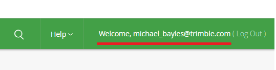
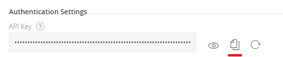

# Getting Started

## Enabling Access To Trimble Artificatory

### Get Artifactory Api Key


1. Login to Trimble E-Tools Artifactory [https://artifactory.trimble.tools/](https://artifactory.trimble.tools/)  

2. Click your username in the upper right:



3. Unlock your profile (if required enter your password again):


4. Copy your Api Key:




### Set Artificatory Access in Gradle

In your Android projects root `build.gradle` add the Trimble Mobile Ecosystem maven repository:
```groovy
allprojects {
    repositories {
        google()
        mavenCentral()
        maven {
            url = "https://artifactory.trimble.tools/artifactory/ttm-mobile-ecosystem-maven"
            credentials{
                username = artifactory_user
                password = artifactory_password
            }
        }
    }
}
```

To keep your Artifactory Api Key secret you need to store it in your **user** [gradle.properties](https://docs.gradle.org/current/userguide/build_environment.html#sec:gradle_configuration_properties) file.

The default location is `USER_HOME/.gradle/gradle.properties` e.g. `C:\Users\<your user name>\.gradle\gradle.properties`.

Then add:
```groovy
artifactory_user=michael_bayles@trimble.com
artifactory_password=************
```

You can see this in action in the sample app.

## Setting up the Dependencies

You need to include the Backbone API in your project, for example, as a Gradle dependency:
```groovy
implementation('com.trimble:ttm-mep-backbone-api:5.2.0-SNAPSHOT') {
    changing = true
}
```
When a release is ready, you would change this to, e.g.,:
```groovy
implementation 'com.trimble:ttm-mep-backbone-api:5.2.0' 
```

## Setting up without Artificatory Access

If you do not have access to Artificatory you can also add the backbone aar file to the libs folder of the application, 
and update the build.gradle file to include `*.aar` as was done in this project. 

## Tablet Setup

Follow [Tablet Setup Instructions](https://confluence.trimble.tools/pages/viewpage.action?spaceKey=MAINE&title=Android+Developers%3A+Get+Started+with+Instinct+Platform+Core+Apps+and+Libraries) before using your device to test your Backbone integration. You will need to install additional apks and setup your tablet with other dependencies.

