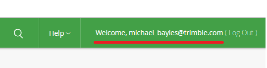
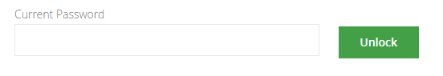
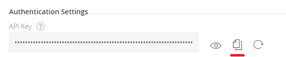

# sample-app

A small sample application that demonstrates Trimble's Mobile Ecosystem Platform

## Getting Started

Login to https://trimbletransportation.jfrog.io/trimbletransportation with your Artifactory credentials that were supplied to you.

Once logged in, click your username in the upper right (https://trimbletransportation.jfrog.io/trimbletransportation/webapp/#/profile).



Enter your password again (if required) and press unlock



The API Key section should appear. Press the "Copy key to clipboard" button.



Open your [gradle.properties](https://docs.gradle.org/current/userguide/build_environment.html#sec:gradle_configuration_properties) file and create 2 properties. The first, `tt_artifactory_username`, is the email address used to login to Artifactory. The second, `tt_artifactory_password`, is the long api key in your clipboard.

```gradle
tt_artifactory_username=michael_bayles@trimble.com
tt_artifactory_password=************
```

Inside the root [build.gradle](build.gradle), you'll see the reference to Artifactory:

```gradle
allprojects {
    repositories {
        google()
        jcenter()
        maven {
            url = "https://trimbletransportation.jfrog.io/trimbletransportation/ttm-mvn-mobile-ecosystem"
            credentials {
                username = tt_artifactory_username
                password = tt_artifactory_password
            }
        }
    }
}
```

Inside [app/build.gradle](app/build.gradle), you'll see 2 dependencies that allow you to interact with the ecosystem:

```gradle
implementation 'com.trimble:ttm-mep-backbone-api:1.0'
implementation 'com.trimble:ttm-mep-backbone-logging:1.0'
```

If you've successfully authenticated with Artifactory, these dependencies should download upon a Gradle sync.