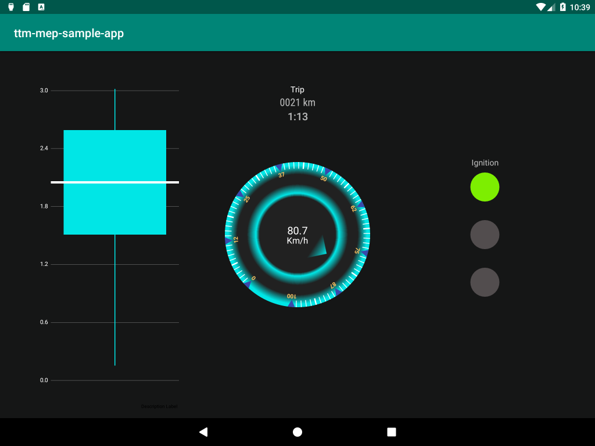

# Trimble Mobile Ecosystem Data Backbone Sample App



## Getting Started

You will not be able to build this project until you set up access to the Trimble Artifactory Repo.

Please follow the [Backbone Setup Guide](doc/BackboneGettingStarted.md).

## Overview

This sample app demonstrates how to use a few of the most important methods of the [Backbone Api](doc/Backbone.md).

The ViewModel uses [Callback Backbone](doc/CallbackBackbone.md) to fetch data from Backbone.
 
### View Elements

#### Ignition

On the right are three lights representing the state of the ignition:
* Green = Engine On
* Yellow = Accessory
* Red = Ignition Off

The sample app code to monitor Ignition is:
```kotlin
private val ignitionQuery = backbone.monitorFetch(listOf(IGNITION_KEY, ENGINE_ON_KEY)) { result ->
    _ignition.postValue(
        when {
            result[ENGINE_ON_KEY]?.valueAs<Boolean>() == true -> IgnitionState.ENGINE_ON
            result[IGNITION_KEY]?.valueAs<Boolean>() == true -> IgnitionState.ACCESSORY
            else -> IgnitionState.OFF
        }
    )
}
``` 
There are few things to note in the above code:
* both [IGNITION_KEY](doc/BackboneDataTypes.md) and [ENGINE_ON_KEY](doc/BackboneDataTypes.md) are being fetched
* [monitorFetch](doc/CallbackBackbone.md) is used

**Why Both Keys**

Since it is possible for ignition and engine state to come from two different sources they are stored as separate keys in Backbone.
In the above code, if either the [IGNITION_KEY](doc/BackboneDataTypes.md) or [ENGINE_ON_KEY](doc/BackboneDataTypes.md) change
then the callback is executed with a new [BackboneResult](doc/BackboneResult.md). 
The [BackboneResult](doc/BackboneResult.md) contains the state of both keys, allowing the IgnitionState to be determined with concise when statement.

**Why Monitor Fetch**

It would be possible to get the same behaviour by using [periodicFetch](doc/CallbackBackbone.md) instead of [monitorFetch](doc/CallbackBackbone.md)
but we don't because it would degrade the performance of the device. 

Backbone is a separate app running in a different process so fetching data uses Inter-Process Communication (IPC) which is a little expensive.
Under the hood Android is using [IPC Binders](https://events.static.linuxfound.org/images/stories/slides/abs2013_gargentas.pdf)
which require handshake and setup steps before each fetch. 

To keep your Android device performing properly use [monitorFetch](doc/CallbackBackbone.md) when fetching infrequently changing [BackboneKeys](doc/BackboneDataTypes.md).

#### Trip

At the top of the screen are two numbers representing the distance and amount of time since the engine was started.

The sample app code to publish Trip is:
```kotlin
private val tripQuery = TripUpdater().let { updateTrip ->
    backbone.periodicFetch(
        periodInMillis = 60 * 1000,
        keys = listOf(ENGINE_ODOMETER_KM_KEY, TIME_ENGINE_ON_SECONDS_KEY)
    ) { result ->
        updateTrip.with(result)?.let { _trip.postValue(it) }
    }
}
```
There are few things to note in the above code:
* both [ENGINE_ODOMETER_KM_KEY](doc/BackboneDataTypes.md) and [TIME_ENGINE_ON_SECONDS_KEY](doc/BackboneDataTypes.md) are being fetched.
* [periodicFetch](doc/CallbackBackbone.md) is used with a period of 60s

**Why Both Keys**

The TripUpdater determines the current distance and time of a trip by comparing 
new [ENGINE_ODOMETER_KM_KEY](doc/BackboneDataTypes.md) and [TIME_ENGINE_ON_SECONDS_KEY](doc/BackboneDataTypes.md) values
to previous values. When the engine_on_time decreases then a trip is restarted and the starting odometer reading is saved,
otherwise `distance = currentOdometer - startOdometer`. 
The time of the trip is always the amount of time the engine has been on.

By having a single [BackboneResult](doc/BackboneResult.md) with both [ENGINE_ODOMETER_KM_KEY](doc/BackboneDataTypes.md) and [TIME_ENGINE_ON_SECONDS_KEY](doc/BackboneDataTypes.md)
it makes it easier to keep the two values in sync.

**Why Periodic Fetch**
  
The [TIME_ENGINE_ON_SECONDS_KEY](doc/BackboneDataTypes.md) is updated about once every second 
and [ENGINE_ODOMETER_KM_KEY](doc/BackboneDataTypes.md) is usually updated about every 2 seconds.
If the Trip view used a [monitorFetch](doc/CallbackBackbone.md) then it would be receiving results every second. 
Vehicles can't travel very far in a second so most of the results wouldn't actually change the view.
 
By fetching Trip data every minute, each result is meaningful and the system is put under less stress. 
  
#### Speedometer

In the center of the screen is a speedometer displaying the current speed of the vehicle.

The sample app code to fetch the speed is:
```kotlin
private val speedQuery = backbone.periodicFetch(periodInMillis = 2 * 1000, key = ENGINE_SPEED_KMH_KEY) { result ->
    _speed.postValue(result.valueAs<Float>())
}
```

There are a few things to note in the above code:
* in the callback the result is a [BackboneData](doc/BackboneResult.md) instead of a [BackboneResult](doc/BackboneResult.md)
* the value is a Float instead of a Double like [ENGINE_SPEED_KMH_KEY](doc/BackboneDataTypes.md) is supposed to be.

**Why Backbone Data**

Since only the [ENGINE_SPEED_KMH_KEY](doc/BackboneDataTypes.md) is being fetched there is no possibility of multiple result values.
The single key version of [periodicFetch](doc/CallbackBackbone.md) returns [BackboneData](doc/BackboneResult.md) 
instead of a [BackboneResult](doc/BackboneResult.md) so indexing the value using a [BackboneKey](doc/BackboneDataTypes.md) isn't necessary.

It should be noted that if you use a single [BackboneKey](doc/BackboneDataTypes.md) in a list like:
`backbone.periodicFetch(periodInMillis = 2 * 1000, keys = listOf(ENGINE_SPEED_KMH_KEY))`
then the callback **WILL** receive a [BackboneResult](doc/BackboneResult.md) **NOT** a [BackboneData](doc/BackboneResult.md)

**Why a Float**

Internally every [BacbkoneData](doc/BackboneResult.md) stores its value as JSON. 
The valueAs method uses string interpolation to try and cast the value to the desired class.
In other words, since [ENGINE_SPEED_KMH_KEY](doc/BackboneDataTypes.md) is received as a Double it can be interpolated into any Numeric class.

#### GPS Message Latency

On the left is a box and whisker plot of the interquartile range of the transmission time of each GPS message.

This is the code from the sample app to map Backbone GPS messages to latency:
```kotlin
private val latencyQuery = LatencyCalculator(maxWindowSize = 1000).let { latencyCalculator ->
    backbone.monitorFetch(GPS_DEGREES_KEY) { result ->
        val latencySeconds = (result.receivedTime.time - result.sentTime.time) / 1000f
        latencyCalculator.add(latencySeconds)
        _latency.postValue(latencyCalculator.data)
    }
}
```

There are a few things to note in the above code:
* both the receivedTime and sentTime of [BackboneData](doc/BackboneResult.md) are used

**Why are times in BackboneData**

Whenever Backbone receives a value for a [BackboneKey](doc/BackboneDataTypes.md) the Android devices wall clock time 
is saved as the [BackboneData](doc/BackboneResult.md) received time. 
Additionally, every message sent from a data source has both a value and the time the message was sent.

By subtracting the sentTime from the receivedTime it's possible to calculate the amount of time the message was in transit.

It should be noted that the precision for the two times are different.
* sentTime is Unix Time so is in seconds
* receivedTime is a Java Date so is in milliseconds 
