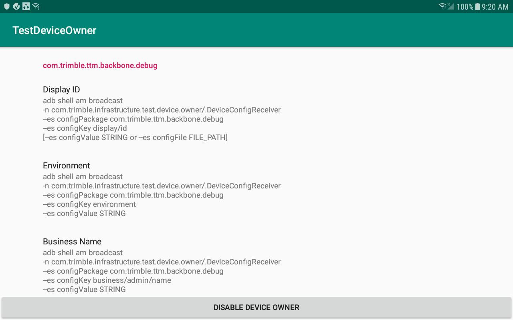
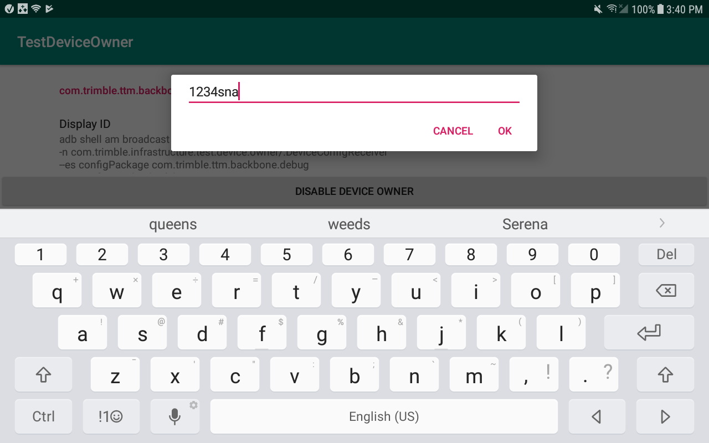
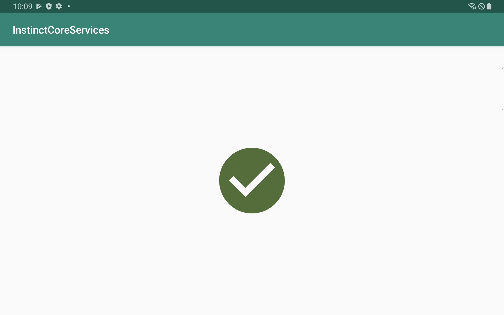
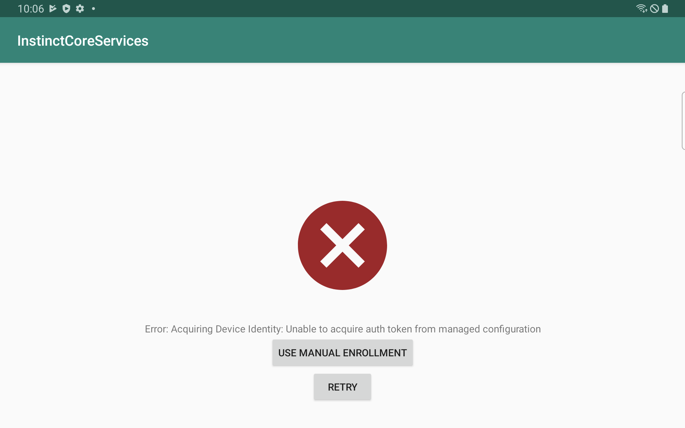
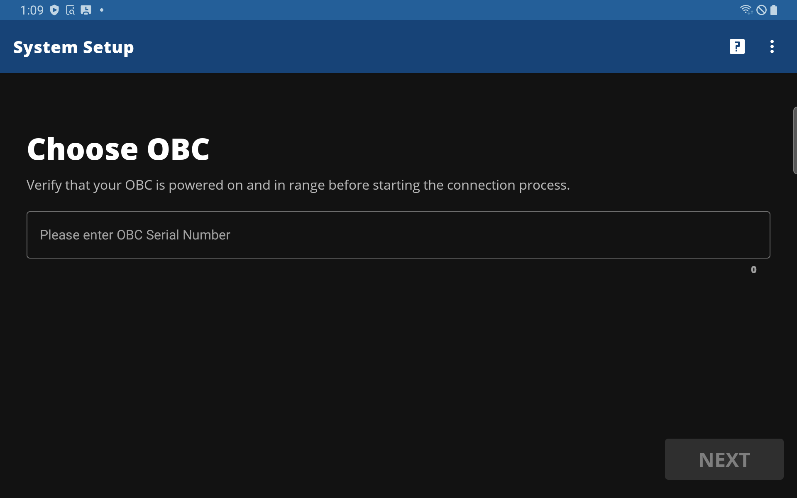

# Android Developers: Get Started with Instinct Platform Core Apps and Libraries
How do I read a value from the backbone? What are the necessary steps to set up my tablet to test my integration? How do I use the backbone library? Where is the documentation? Do I need a TPaas certificate? 
This page will get you started on the road to setting up your development environment to integrate with the Instinct Platform.

## First things first: Set up your Android tablet for testing

In order to test your app's integration, you will need to set up an Android tablet with the core apks and perform a few additional steps, like setting up the TestDeviceOwner and downloading a certificate.

**Prerequisites:**
1. Android device requirements
    a. Android OS 7.1 or higher. Android 12 has not been tested yet.
    b. Samsung Tab Active 3 are well supported as that is what we are providing currently in the field.
    c. MSI Devices: PCT1 is not supported. PCT2 has been tested. Support for other MSI devices has not been fully tested or completed yet.
    d. Make sure the core Instinct applications are installed. For the sample app the following applications are needed: 
        Instinct Core Services,
        System Setup,
        Vehicle Data Services,
        eFleetSuite,
        Trimble Mobile Authenticator,
        App Launcher,
        Watchdog
2. Factory reset your Android device.
    a. You will be installing a new Trimble certificate, and you want to make sure any previous one is removed.
    b. Note that any time you factory reset the tablet, it will wipe out the core services app keystore, and you will need to get a new certificate.
3. Connect your Android device to Wifi. (But NOT an OBC. Connect to another internet connection for the setup process).
4. Make sure to update your OBC if it is on old firmware.

## Test Device Owner

As part of the install script, TestDeviceOwner was made the device owner. TestDeviceOwner is an app that we use to "fake" a couple values that will be provided by the EMM in the field. 
In order to avoid having to install using the EMM, we just use the TestDeviceOwner to set the values we need.

1. Launch TestDeviceOwner. It should look something like this.
   

2. You will need to set values for Display ID. Simply press in the respective areas to get the dialog box.
   

Display ID is the tablet serial number. You don't have to set the actual serial number, but once you set a value it identifies your tablet to some backend systems. 
You don't want to change that value once it is set, because it is part of a unique identifier used when obtaining a certificate.

Note: that if you use the same display ID but with differing levels of capitalization, re-enrollment will not work.

3. Environment should be set to "STAGE". Do not change it to PROD; developer testing should always be in STAGE. You can tap on that setting to make sure that STAGE is selected.
4. Business Name should remain PEOPLENET; TOGS is obsolete. 
5. Do not set a value for Authorization Token. That value is set by the EMM for the pre-authorized certificates flow, 
   and for development you will be doing the manual flow
6. After setting the values, restart your tablet.

## Obtaining a Device Certificate
Open up the Core Services app. The app will display an 8 character string; e.g., ANC8WEYU. If instead you see an error, make sure you have a wifi connection, and hit the back button. This 8-character string needs to be registered in the web portal in order to download a certificate. Let a Trimble representative know what environment you are in, and then give them the 8 digit code so they can enroll the device, 
and pretty soon the Core Services app should display a progress circle and then a green checkmark. At that point, the certificate is installed and you are ready to go!

After this, if you need to check if your tablet has a certificate, you can launch Instinct Core Services. If the green checkmark is there, you are good to go!

## System Setup
Finally, if you are trying to read telematics values from the Backbone, you need to run System Setup in order to get some data flowing to the Backbone. 
Before launching System Setup, ensure that your tablet is online; the first thing System Setup does is retrieve another Trimble certificate in order to communicate with the OBC. 
Then make sure your OBC is "pending" or activated in the PFM. It doesn't matter if it's already activated or if this will be a new install.

Enter the OBC dsn, for example, 11002467. You may be prompted to enter a Vehicle ID as well if this is a new install. This is a string of 10 characters or less (as mandated by the ELD rules), 
and can not be the same as the DSN. When you have reached the final screen, you are ready to get some data! If you have access to an engine simulator for your OBC, you can even pump some driving data into the backbone.

After you run setup, the OBC connector publishes some additional values to the Backbone, like PFM customer Id (Cid), Obc id, and Truck Number (aka VehicleId in the Backbone).

Next steps: Start developing!