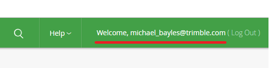
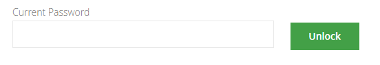
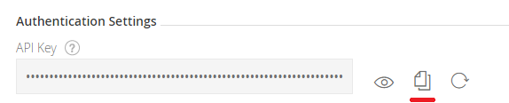

# Getting started

## Enabling Access To Trimble Artificatory

### Get Artifactory Api Key

1. Login to https://trimbletransportation.jfrog.io/trimbletransportation with your Artifactory credentials that were supplied to you.

2. Click your username in the upper right:



3. Unlock your profile (if required enter your password again):



4. Copy your Api Key:




### Set Artificatory Access in Gradle

In your Android projects root [build.gradle](build.gradle) add the Trimble Mobile Ecosystem maven repository:
```gradle
allprojects {
    repositories {
        google()
        jcenter()
        maven {
            url = "https://trimbletransportation.jfrog.io/trimbletransportation/ttm-mvn-mobile-ecosystem"
            credentials {
                username = tt_artifactory_username
                password = tt_artifactory_api_key
            }
        }
    }
}
``` 

To keep your Artifactory Api Key secret you need to store it in your **user** [gradle.properties](https://docs.gradle.org/current/userguide/build_environment.html#sec:gradle_configuration_properties) file.

The default location is `USER_HOME/.gradle/gradle.properties` e.g. `C:\Users\<your user name>\.gradle\gradle.properties`.

Then add:
```gradle
tt_artifactory_username=michael_bayles@trimble.com
tt_artifactory_api_key=************
```

## Setting up the dependencies

You need to include the Backbone API in your project, for example, as a Gradle dependency:
```groovy
implementation 'com.trimble:ttm-backbone-api:1.0'
```

You also need to include Gson because the Backbone API uses it internally, for example, as a Gradle dependency:
```groovy
implementation 'com.google.code.gson:gson:2.8.5'
```
