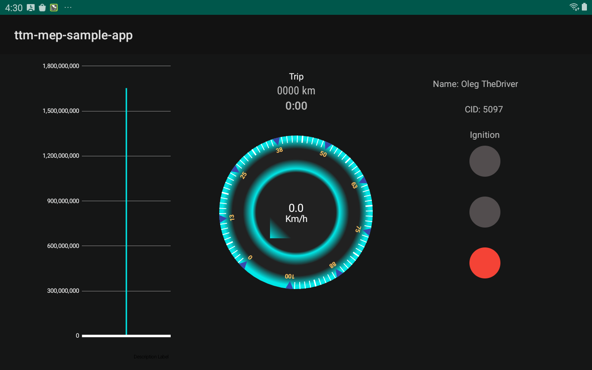

# Trimble Mobile Ecosystem Data Backbone Sample App



## Getting Started

You will not be able to build this project until you set up access to the Trimble Artifactory Repo.

Please follow the [Backbone Setup Guide](../BackboneGettingStarted.md).

## Overview

This sample app uses Backbone to retrieve and monitor data stored in the Backbone App.

In order to effectively use Backbone, it is important to learn the following:
* What is a Backbone.Retriever
* Difference between SingleEntryQuery and MultipleEntryQuery
* When to monitor data for changes and when to fetch data periodically

## Use Backbone values

**Read a Backbone Key**
Suppose you want to read CustomerId from the backbone. You would add the following file to res/xml in your app:

res/xml/trimble_data_permissions.xml
<?xml version="1.0" encoding="utf-8"?>
<trimble-data-permissions>
  <protected-data-provider package="com.trimble.ttm.backbone">
    <action name="read">
      <resource>vehicle/customerid</resource>
    </action>
  </protected-data-provider>
</trimble-data-permissions>

You will need to add each value you want to read to the file otherwise your application will not have permission. This is done for security reasons so only authorized apps can use the backbone. 
This is done using an access control lists (acl). Upon arrival your device will likely have local acls so this file alone will be enough. 
Once your app is ready reach out to a Trimble rep to get those permissions setup remotely so your application will have those permissions in the field.
Below is a list of values that might be useful for most users: 

**Backbone.Retiever**   **Key for XML**
BusinessAdminName       `business/admin/name`
DisplayId               `display/id`
Environment             `environment`
ActiveHOSRuleSet        `user/eld/active_hos_ruleset`
CurrentUser             `user/current`
CurrentDriver           `user/current_driver`
EldDriverId             `eld/driver/id`
Motion                  `vehicle/motion`
Shipments              `vehicle/eld/shipments`
Trailers                `vehicle/eld/trailers`
UserAvailableTime       `user/eld/available/time`
UserEldExemptions       `user/eld/exemptions`
UserEldRuleSet          `user/eld/rule_set_id`
UserEldStatus           `user/eld/status`
UserEldThirdPartyId     `user/eld/third_party_id`
UserTripDistanceKm      `user/eld/distance_driven_today_km`
UserLogInStatus         `user/login/status`
UserName                `user/name/v2`
UserTID                 `user/trimble/id`
CustomerId              `vehicle/customerid`
GpsDegrees              `vehicle/gps_degrees`
ObcCellDataConnection   `vehicle/obc/network/cellular/data_connection`
ObcConnection           `vehicle/obc/connection`
ObcId                   `vehicle/obc/id`
VehicleCurrentGear      `vehicle/current_gear`
VehicleTurnSignal       `vehicle/turn_signal`
VehicleId               `vehicle/id`

EcmConnection           `vehicle/ecm/connection`
EngineHours             `vehicle/ecm/engine/hours`
EngineOdometerKm        `vehicle/ecm/odometer_km`
EngineOn                `vehicle/ecm/engine/on`
EngineSpeedKmh          `vehicle/ecm/speed_kmh`
Ignition                `vehicle/ecm/ignition`
TimeEngineOn            `vehicle/ecm/engine/time_on_seconds`
TotalFuelConsumed       `vehicle/ecm/engine/fuel_l`
Vin                     `vehicle/ecm/vin`

OerManualEnabled        `oer/manual_enabled`

WorkflowCurrentTrip     `workflow/current_trip`

## What is a Backbone.Retriever

Data in the Backbone app is stored as JSON and identified by a unique key. 

Backbone.Retrievers contains a unique key and a method to map the JSON into a pre-defined data object.

In other words, when backbone is asked to retrieve GpsDegrees
the returned Backbone.Entry
contains GpsDegrees as data and not as a JSON.
```kotlin
val gps: Backbone.Entry<GpsDegrees>? = backbone.retrieveDataFor(GpsDegrees).fetch()
```

List of all defined Backbone.Retrievers

**Note:** *All the defined Backbone.Retrievers are Companion Objects of the given data type. That's how GpsDegrees is a data class and a Backbone.Retriever.*

## Difference between SingleKeyQuery and MultipleKeyQuery

The logic for updating speedometer, at the center of the screen:
```kotlin
backbone
    .retrieveDataFor(EngineSpeedKmh)
    .every(2, SECONDS)
    .handle { (speed, _) -> _speed.postValue(speed?.value?.toFloat() ?: 0f) }
```

The logic for updating trip (how far/long current trip is), at the top of the screen:
```kotlin
backbone
    .retrieveDataFor(EngineOdometerKm, TimeEngineOn)
    .every(1, MINUTES)
    .handle { result ->
        result[TimeEngineOn]?.let { (engineOn, _) ->
            engineOn?.let { timeEngineOn ->
                _trip.postValue(
                    updateTrip.with(
                        odometer = result[EngineOdometerKm]?.data?.value?.toInt() ?: 0,
                        timeEngineOn = timeEngineOn.value
                    )
                )
            }
        }
    }
```

To calculate the duration of the current trip, both EngineOdometerKm and TimeEngineOn are necessary.
A trip uses a MultipleEntryQuery, unlike speed which uses a SingleEntryQuery, 

With a SingleEntryQuery, a Backbone.Entry is returned directly. However for a MultipleEntryQuery a MultipleEntryQuery.Result is returned.
A MultipleEntryQuery.Result contains a Backbone.Entry for each queried Backbone.Retriever.

Using a MultipleEntryQuery makes it easier to keep different data sources synchronized,
it also makes code easier to understand. 
If we wanted to use only SingleEntryQueries to calculate trip, we would have to do something that looks like this, which is not ideal:
```kotlin
private var shouldUpdate = false
private var odometer: Int = 0
private var timeEngineOn: Long = 0

backbone.retrieveDataFor(EngineOdometerKm)
    .every(1, MINUTES)
    .handle {
        odometer = it?.data?.value?.toInt() ?: 0
        if (shouldUpdate) {
            _trip.postValue(updateTrip.with(odometer, timeEngineOn))
            shouldUpdate = false
        } else {
            shouldUpdate = true
        }
    }

backbone.retrieveDataFor(TimeEngineOn)
    .every(1, MINUTES)
    .handle {
        timeEngineOn = it?.data?.value ?; 0
        if (shouldUpdate) {
            _trip.postValue(updateTrip.with(odometer, timeEngineOn))
            shouldUpdate = false
        } else {
            shouldUpdate = true
        }
    }
```

**Note:** *If Backbone does not have data for a desired Backbone.Retriever then the value in the MultipleEntryQuery.Result will be null.*
```kotlin
val odometer = result[EngineOdometerKm]?.data?.value?.toInt() ?: 0
```

**Note:** *Backbone.Entry is a [Data Class](https://kotlinlang.org/docs/reference/data-classes.html#data-classes) so [destructuring declaration](https://kotlinlang.org/docs/reference/data-classes.html#data-classes-and-destructuring-declarations) can be used.*
```kotlin
backbone
    .retrieveDataFor(EngineSpeedKmh)
    .every(2, SECONDS)
    .handle { (speed, _) ->  }
```

**Note:** *Backbone.Entry could have a null data field. When the data field is null it means the value was deleted in Backbone. The Backbone.Entry still contains a retrieved time and origin making it possible to determine when the value was deleted and which app deleted it.*
## When to monitor data for changes and when to fetch data periodically

The logic for updating trip, at the top of the screen, retrieves EngineOdometerKm and TimeEngineOn every minute.
```kotlin
backbone
    .retrieveDataFor(EngineOdometerKm, TimeEngineOn)
    .every(1, MINUTES)
    .handle { result ->
        result[TimeEngineOn]?.let { (engineOn, _) ->
            _trip.postValue(
                updateTrip.with(
                    odometer = result[EngineOdometerKm]?.data?.value?.toInt() ?: 0,
                    timeEngineOn = engineOn.value
                )
            )
        }
    }
```

The logic for updating Ignition, at the right of the screen retrieves Ignition and EngineOn whenever one of the values change.
```kotlin
backbone
    .monitorChangesInDataFor(Ignition)
    .alsoMonitor(EngineOn)
    .handle { result ->
        _ignition.postValue(
            when {
                result[EngineOn]?.data?.value == true -> IgnitionState.ENGINE_ON
                result[Ignition]?.data?.value == true -> IgnitionState.ACCESSORY
                else -> IgnitionState.OFF
            }
        )
    }
```

In most vehicles, the EngineOdometerKm and TimeEngineOn are updated every 2 seconds.

If trip was updated everytime EngineOdometerKm or TimeEngineOn is changed,
there would be many updates with no UI change, because trip shows travel time in seconds and distance in KM.

The sample app retrieves trip data every minute to limit the amount of expensive Inter-Process Communication (IPC).

On the other hand, Ignition and EngineOn change only at the end of a driver's trip.
If the query ran periodically, there would be many updates with no UI change. 
It would also be likely for Ignition or EngineOn to change between period completions, causing the UI update to be delayed.

Instead of periodically forcing a fetch, the sample app asks Backbone to send Ignition and EngineOn when one of them changes.

**Note:** *It's possible to create a MultipleEntryQuery that retrieves extra Backbone.Entries when monitored data changes.*

```kotlin
backbone
    .monitorChangesInDataFor(Ignition)
    .alsoRetrieve(EngineOdometerKm, EngineSpeedKmh)
    .handle { result ->
            val ignition = result[Ignition]
            val odometer = result[EngineOdometerKm]
    }
```

**Note:** *It's possible to create a Query that both monitors data and runs periodically. When a change occurs then the period is reset. The code below fetches Ignition at least once a minute.*

```kotlin
backbone
    .monitorChangesInDataFor(Ignition)
    .every(1, MINUTES)
    .handle { (ignition, _) ->
    
    }
```

The logic for getting user data is shown below. It is slightly more convoluted because UserName is a map where is the userId is the key. So whenever we get UserName we also get the CurrentUser since it contains the userId so we can get UserName object correlated to the current user.
```kotlin
backbone
    .monitorChangesInDataFor(UserName)
    .alsoMonitor(CurrentUser)
    .handle { result ->
        result[CurrentUser]?.data?.let {
            result[UserName]?.data?.get(it)?.let {
            
            }
        }
    }
```